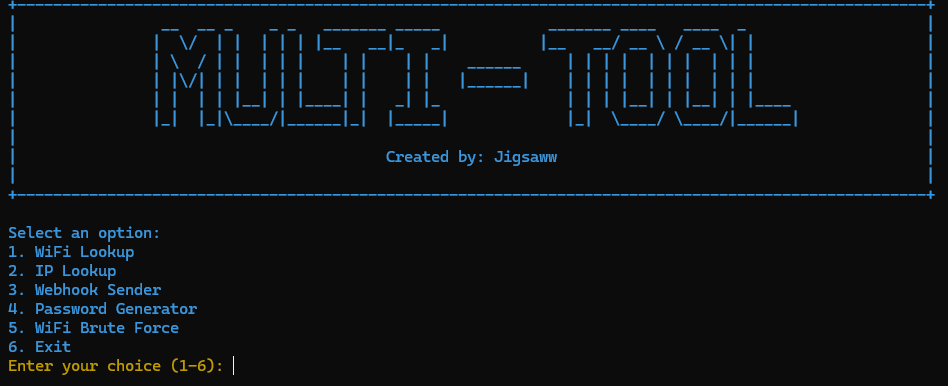

# Multi-Tool Application

This multi-tool application provides a variety of utilities for users, including WiFi lookup, IP lookup, webhook sending, password generator, and WiFi brute force capabilities. Each tool is designed to be user-friendly and accessible via a terminal interface.




## Table of Contents

- [Installation](#installation)
- [Usage](#usage)
- [Tools](#tools)
  - [WiFi Lookup](#wifi-lookup)
  - [IP Lookup](#ip-lookup)
  - [Webhook Sender](#webhook-sender)
  - [Password Generator](#password-generator)
  - [WiFi Brute Force](#wifi-brute-force)

## Installation

To set up the project, clone the repository and install the required dependencies:

```bash
git clone https://github.com/Blanknetework/Multi-Tool.git
cd multi-tool-app
pip install -r requirements.txt
```

## Usage

Run the main application by executing the following command:

```bash
python src/multi_tool.py
```

## Running on Termux
```bash

1. pkg update && pkg upgrade
2. pkg install python
3. pkg install git
4. git clone https://github.com/Blanknetework/Multi-Tool.git
5. cd multi-tool-app
6. pip install -r requirements.txt
7. python src/multi_tool.py

```


Follow the on-screen instructions to select the desired tool.

## Tools

### WiFi Lookup
This tool scans for available WiFi networks and displays their details, such as SSID, signal strength, and security type.

### IP Lookup
The IP lookup tool retrieves and displays information about a given IP address, including geolocation data.

### Webhook Sender
This functionality allows users to send webhooks to specified URLs with customizable payloads, enabling integration with various services.

### Password Generator
Generate secure and random passwords based on user-defined criteria, including length and character types.

### WiFi Brute Force
This tool attempts to crack WiFi passwords using a list of potential passwords, providing a method for testing network security.

## Contributing

Contributions are welcome! Please feel free to submit a pull request or open an issue for any suggestions or improvements.

## License

This project is licensed under the MIT License. See the LICENSE file for more details.
